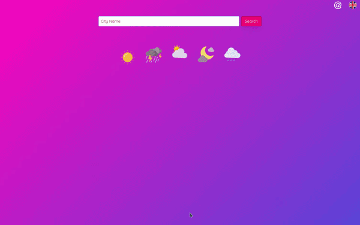
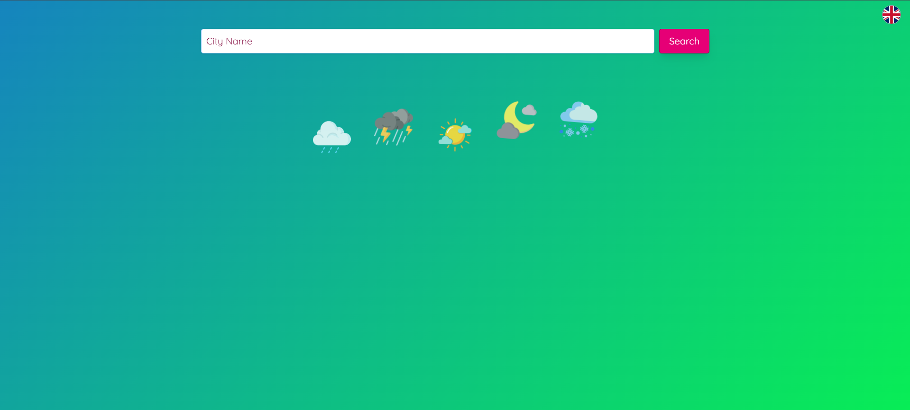
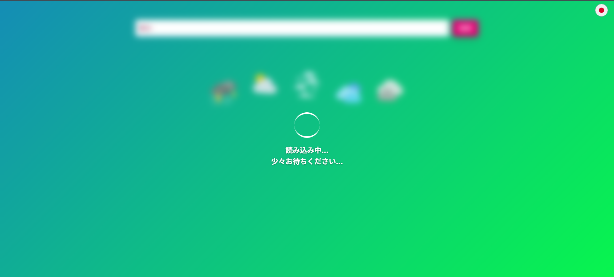
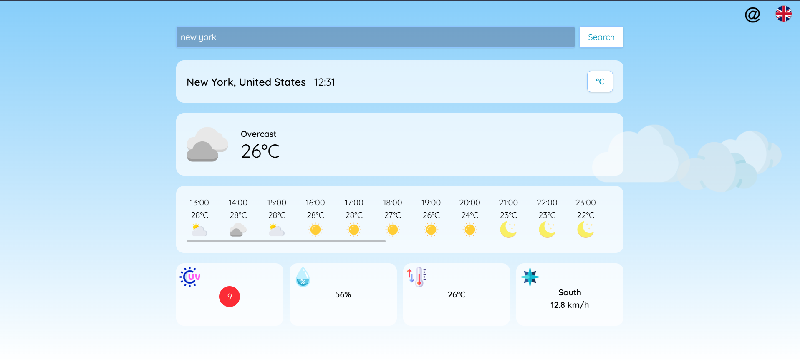
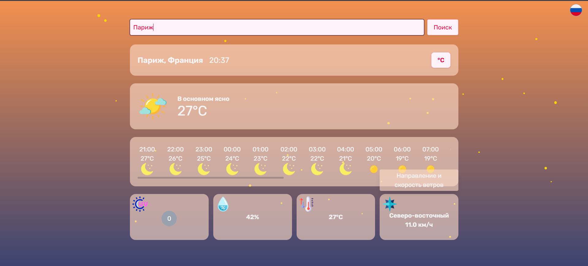
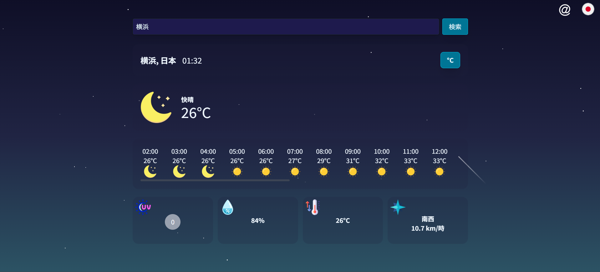
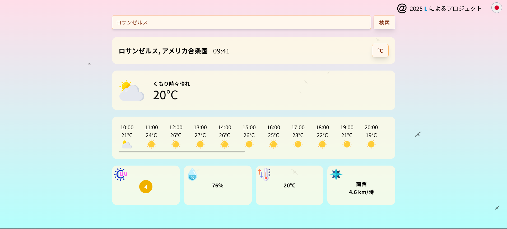
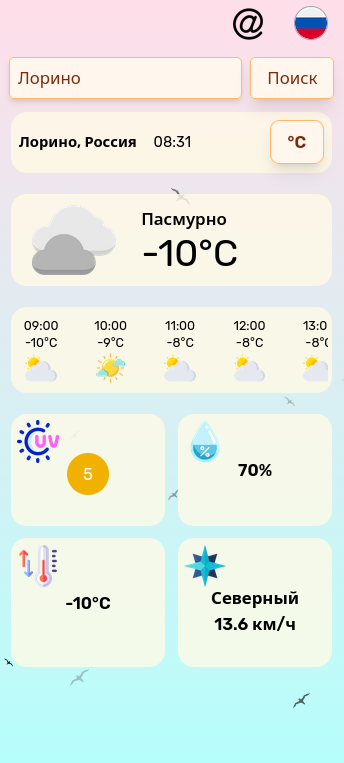

# Weather App with Dynamic Animations


A fully responsive weather application that visualizes real-time weather through dynamic, animated scenes and supports several languages. Build with React 19 + TypeScript and styled via Tailwind CSS, the app adjusts visuals by location, and time of day.

> **Note for Japanese Recruiters**:  
> 日本語の説明が必要な場合は、[日本語版README](README.ja.md)をご覧ください。  
> 翻訳の経験を活かした国際化対応が得意です。

[Live Demo](https://rue-eru.github.io/weather-app)

| State | Interface |
|------|--------|
| App Gif |  |
| Starting Screen (EN) |  |
| Loading Screen (JA) |  |
| Timezone: Day (EN) |  |
| Timezone: Evening (RU) |  | 
| Timezone: Night (JA) |  |
| Timezone: Morning (JA) |  |
| Mobile (RU) |  |

---

## ✨ Features

- Real-time weather from multiple APIs: **Open-Meteo**, **Moment Timezone**, **GeoNames**, and **OpenUV**
- Dynamic CSS animations: stars, shooting stars, birds, clouds, flickering dots, etc.
- Fully responsive — works on mobile up to 4K screens
- Multilingual support (English, Japanese, Russian) via **i18next**
- Built with **React 19** + **TypeScript** + **Tailwind CSS**

---

## 🌐 API Integration Challenges & Solutions

### Weather Data Consistency

> _"Open-Meteo provides excellent free data, but can be inconsistent in timezones and UV info."_

**Key Fixes**:

- ⏰ **Timezone Discrepancies**  
  - Combined Moment-Timezone and GeoNames to reliably handle mismatches in timezone data  
  - Example: local UTC was +5, while Open-Meteo returned UTC+3 or UTC+9 inconsistently  

- ☀️ **UV Data Limitations**  
  - Open-Meteo only offers daily `uv_index_max` and `uv_index_clear_sky_max`  
  - Used OpenUV for accurate, time-sensitive UV data  
  - I tried multiple calculations using Open-Meteo’s data, but it lacked precision for real-time use so you may see its data as a fallback when OpenUV's daily quota is being used up (50req/day)

---

## 💪 Lessons Learned & Development Struggles

Aside from the "API wars" (which I spent countless hours debugging and cross-checking), I encountered many other challenges that helped me grow as a junior dev:

### 🎞 CSS Animations
- Creating birds, clouds, shooting stars, and flickering lights was fun, but also frustrating at times
- Timing elements (e.g., birds disappearing too soon or stars spawning mid-screen) took debugging
- I used `map()` to generate animation elements, and only during deployment noticed duplicated `key` warnings — fixed with `crypto.randomUUID()`
- Had an idea for smooth "@"'s animation while hidden text had to push it over, but settled for the clean working solution instead. 

### 📱 Responsiveness
- Though I’ve made responsive designs before, this was my first time using **only Tailwind CSS**
- I mistakenly started with desktop-first layouts, then realized Tailwind is **mobile-first**  
  → Spent several evenings refactoring
- I spend a lot of time trying to deal with a conflict of two containers. One wouldn't allow another one to be shown on hover due to `overflow-hidden` property, but I couln't remove it since without it the text glitched before dissapearing. That also led to problems with that same component overflowing on `sm` screen layouts due to different languages had to use different word placing on the screen.

### 🕒 Timezone Bugs
- Some buttons and animations wouldn't render properly due to time zone mismatch
- Debugging was difficult since fallbacks relied on the system's local time

### 🌤 Icon Handling
- Weather icon logic had to be rewritten multiple times to correctly reflect conditions at **night vs. day**
- Switched from several small, repeated functions to a more flexible main handler

### 🎨 Frontend Libraries
- Tried to use **Shadcn/UI**, but introduced it late in development
- One component (tooltip-style description window) lacked proper styling and broke layout
- Shadcn also had compatibility issues with React 19  
  → Rather than refactor everything, I built a custom component instead

### 🧩 Git
Who doesn't make mistakes when starting working with Git?
- At first i accidentally merged my working first version with empty repo so ended up spending hours of gooogling how to return it and [thank you bro for saving me](https://dev.to/towernter/how-to-recover-a-project-or-files-deleted-when-running-git-commands-40je)
- Then I uploaded a final working version and my images refused to render also I spend some time trying to fix it with main problem being github pages being too sensetive to path declarations
- I didn't fix it at first since nothing worked and after adding one more component with credits faced the problem with it also not rendering. Occasionally I just pushed all changes to master branch and didn't deploy the project for github pages to pick those changes.

---

## 🚀 Deployment

Hosted via GitHub Pages: [Live Demo](https://rue-eru.github.io/weather-app) 

---

## 🛠 Running Locally

```bash
git clone https://github.com/rue-eru/weather-app.git
npm install
npm run dev