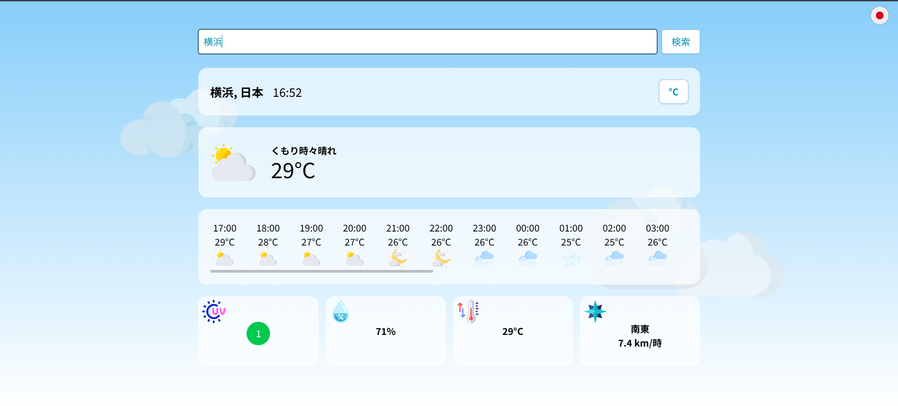
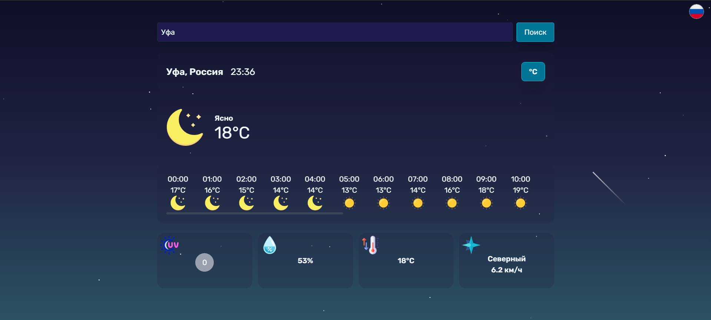
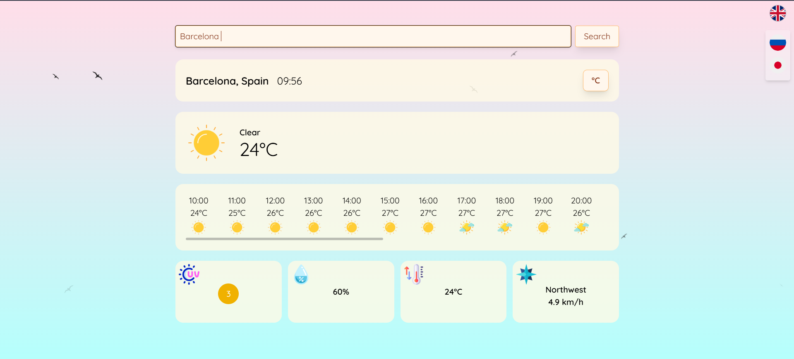
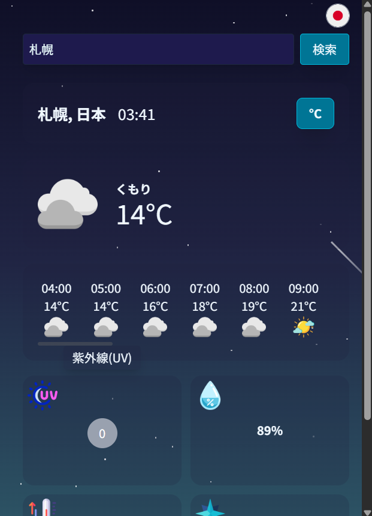

# Weather App with Dynamic Animations

A fully responsive weather application that visualizes real-time weather through dynamic, animated scenes and supports several languages. Build with React 19 + TypeScript and styled via Tailwind CSS, the app adjusts visuals by location, and time of day.

[Live Demo](https://rue-eru.github.io/weather-app)








---

## ✨ Features

- Real-time weather from multiple APIs: **Open-Meteo**, **Moment Timezone**, **GeoNames**, and **OpenUV**
- Dynamic CSS animations: stars, shooting stars, birds, clouds, flickering dots, etc.
- Fully responsive — works on mobile up to 4K screens
- Multilingual support (English, Japanese, Russian) via **i18next**
- Built with **React 19** + **TypeScript** + **Tailwind CSS**

---

## 🌐 API Integration Challenges & Solutions

### Weather Data Consistency

> _"Open-Meteo provides excellent free data, but can be inconsistent in timezones and UV info."_

**Key Fixes**:

- ⏰ **Timezone Discrepancies**  
  - Combined Moment-Timezone and GeoNames to reliably handle mismatches in timezone data  
  - Example: local UTC was +5, while Open-Meteo returned UTC+3 or UTC+9 inconsistently  

- ☀️ **UV Data Limitations**  
  - Open-Meteo only offers daily `uv_index_max` and `uv_index_clear_sky_max`  
  - Used OpenUV for accurate, time-sensitive UV data  
  - I tried multiple calculations using Open-Meteo’s data, but it lacked precision for real-time use so you may see its data as a fallback when OpenUV's daily quota is being used up (50req/day)

---

## 💪 Lessons Learned & Development Struggles

Aside from the "API wars" (which I spent countless hours debugging and cross-checking), I encountered many other challenges that helped me grow as a junior dev:

### 🎞 CSS Animations
- Creating birds, clouds, shooting stars, and flickering lights was fun, but also frustrating at times
- Timing elements (e.g., birds disappearing too soon or stars spawning mid-screen) took debugging
- I used `map()` to generate animation elements, and only during deployment noticed duplicated `key` warnings — fixed with `crypto.randomUUID()`

### 📱 Responsiveness
- Though I’ve made responsive designs before, this was my first time using **only Tailwind CSS**
- I mistakenly started with desktop-first layouts, then realized Tailwind is **mobile-first**  
  → Spent several evenings refactoring

### 🕒 Timezone Bugs
- Some buttons and animations wouldn't render properly due to time zone mismatch
- Debugging was difficult since fallbacks relied on the system's local time

### 🌤 Icon Handling
- Weather icon logic had to be rewritten multiple times to correctly reflect conditions at **night vs. day**
- Switched from several small, repeated functions to a more flexible main handler

### 🧩 Frontend Libraries
- Tried to use **Shadcn/UI**, but introduced it late in development
- One component (tooltip-style description window) lacked proper styling and broke layout
- Shadcn also had compatibility issues with React 19  
  → Rather than refactor everything, I built a custom component instead

---

## 🚀 Deployment

Hosted via GitHub Pages: [Live Demo](https://rue-eru.github.io/weather-app) 

---

## 🛠 Running Locally

```bash
git clone https://github.com/rue-eru/weather-app.git
npm install
npm run dev